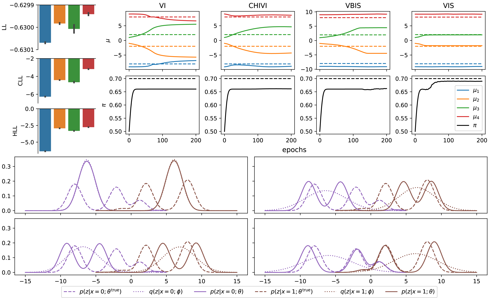

# Forward $\chi^2$ Divergence Based Variational Importance Sampling [ICLR 2024 Spotlight]

<div align='center' >Chengrui Li, Yule Wang, Weihan Li, and Anqi Wu</div>

[[paper]](https://openreview.net/pdf?id=HD5Y7M8Xdk) [[arXiv]](https://arxiv.org/abs/2311.02516) [[slides]](https://jerrysoybean.github.io/assets/pdf/VIS%202023.10.5%20pre.pdf) [[文章]](https://jerrysoybean.github.io/assets/pdf/VIS_ICLR_2024_%E4%B8%AD%E6%96%87.pdf)


## 1 Tutorial
[demo.ipynb](/demo.ipynb) is a step-by-step tutorial that run VI or VIS on a toy mixture model.

## 2 Paper's Results Reproduction
For example, consider the toy mixture model in our paper.

Go to the folder `mixture`. No installation is needed.

Create three folders in `mixture`: `model`, `np`, and `csv`.

Run `main.py` with different `idx` ranging from 0 to 39.

```
python main.py [idx]
```

This `idx` specifies the `method` and the random `seed` via
```
method_list = ['VI', 'CHIVI', 'VBIS', 'VIS']
seed_list = np.arange(10)

arg_index = np.unravel_index(args.idx, (len(method_list), len(seed_list)))
method, seed = method_list[arg_index[0]], seed_list[arg_index[1]]
```

The learned model $p(x,z;\theta)$ and $q(z|x;\phi)$ are saved in `model`. The learning curves are saved in `np`. The quantitative results are saved in `csv`.

Open the `visualization.ipynb`. This jupyter notebook plots Fig. 2 in our paper.

